### Procedure

The basic bioinformatics user interface helps users learn the essential algorithms used in bioinformatics. The steps to use the simulator are as follows:
1.	Open the simulator window

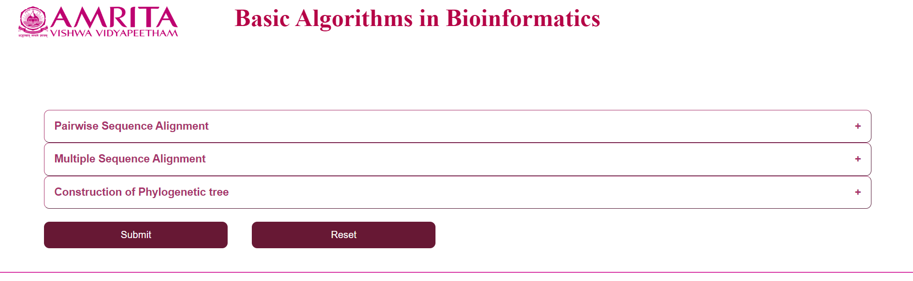

2.	Select an algorithm from the “Pairwise Sequence Alignment” menu
  
  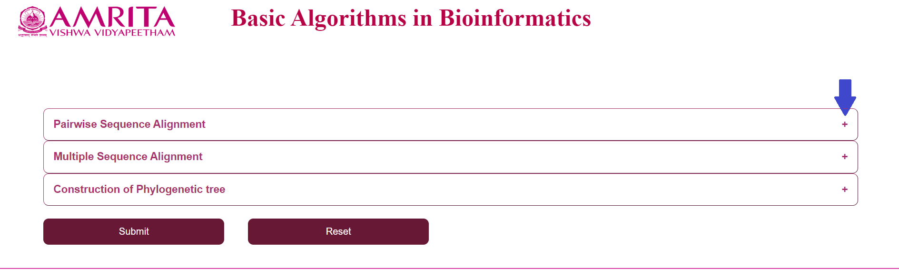
   
  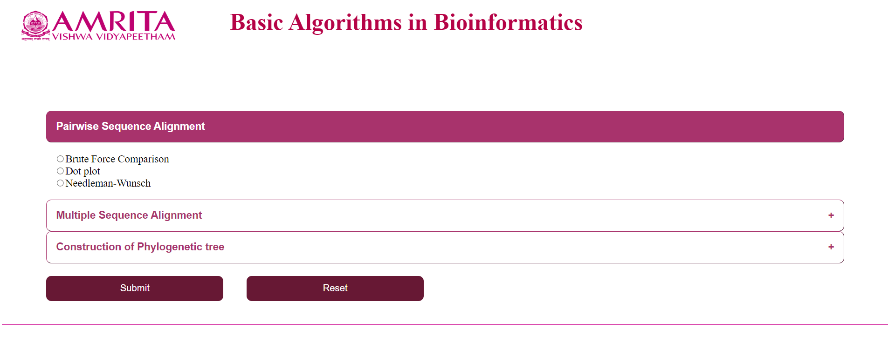
  
  a.	Click on “Brute Force Comparison” and click “Submit”
  
  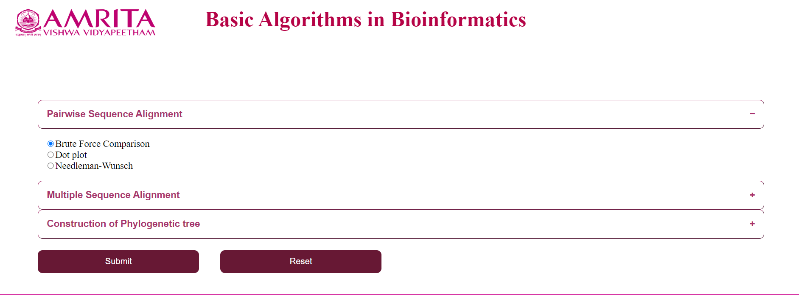
   
  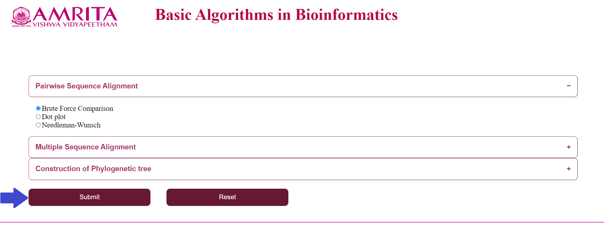
  
  i.	The user could see a new page for Brute Force Algorithm with a “Back” button to go to the previous menu.  Now click on “Upload the FASTA file” and load the nucleotide/ amino acid file in FASTA format
      
  
   
  
   
  
      
  ii.	Click on “Upload the FASTA file to compare” and load the corresponding file (If the first file was a nucleotide file, this should also be a nucleotide file and vice-versa) to compare
       
  
   
  
      
      
  iii.	Click on “Compare”
      
   
  
  
  iv.	Result specifying if the sequence is a match or not will be displayed
      
   
  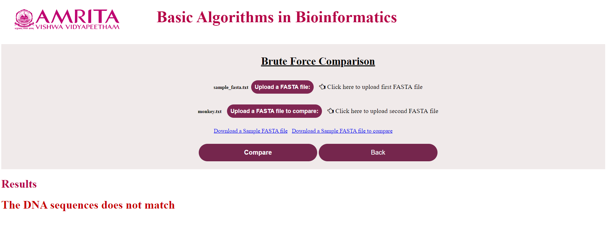 
   
  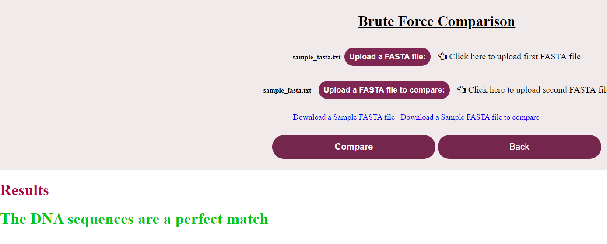
      
  b.	Click on “Dot plot” and click “Submit”
  
   
  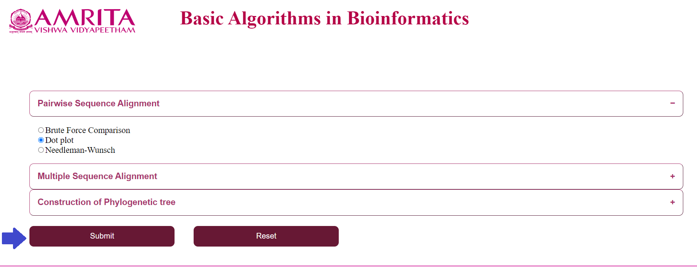
   
  i.	The user could see a new page for Dot Plot with a “Back” button to go to the previous menu.  Now click on “Upload 1st sequence” and load the nucleotide/ amino acid file in FASTA format
      
   
   
  
      
      
  ii.	Click on “Upload 2nd sequence” and load the corresponding file (If the first file was a nucleotide file, this should also be a nucleotide file and vice-versa) to compare
      
   
     
  iii.	Click on “Plot”
      
  
      
  iv.	A dot plot will be visible with dots at the matched characters (better understandable with a smaller sequence of 10-20 characters)
      
   
  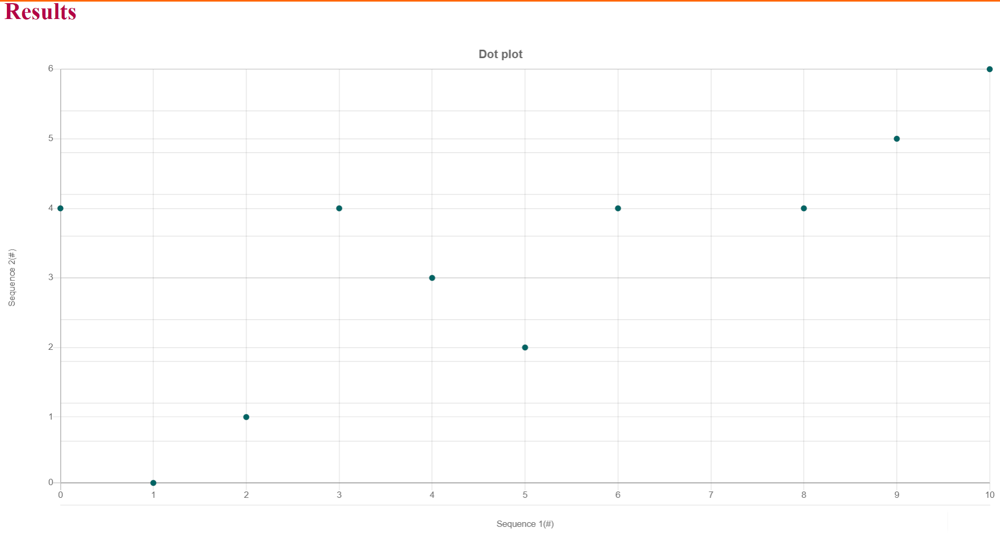
      
      
  c.	Click on “Needlemann-Wunsch” and click “Submit”
  
  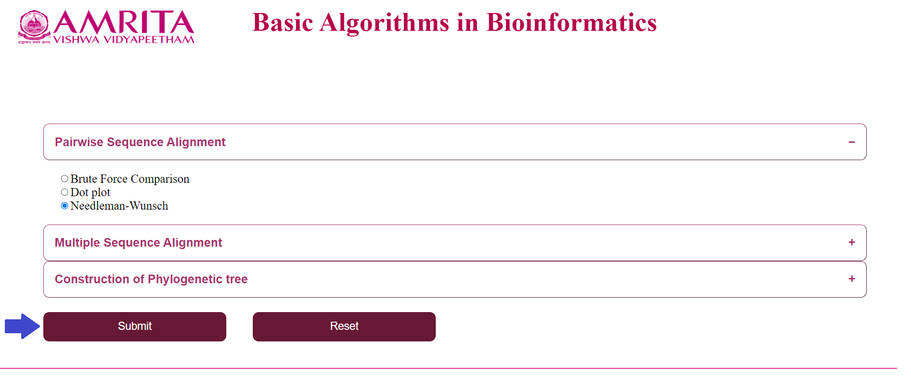
  
  i.	The user could see a new page for Needlemann Wunsch algorithm with a “Back” button to go to the previous menu.  Now click on “Upload a FASTA sequence” and load the nucleotide/ amino acid file in FASTA format
      
  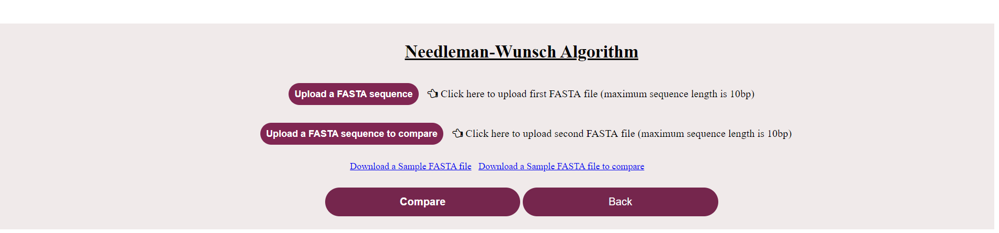 
   
  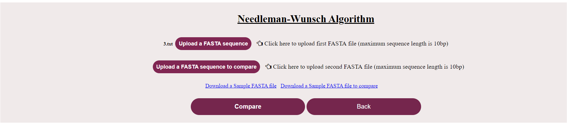
      
  ii.	Click on “Upload a FASTA sequence to compare” and load the corresponding file (If the first file was a nucleotide file, this should also be a nucleotide file and vice-versa) to compare
      
  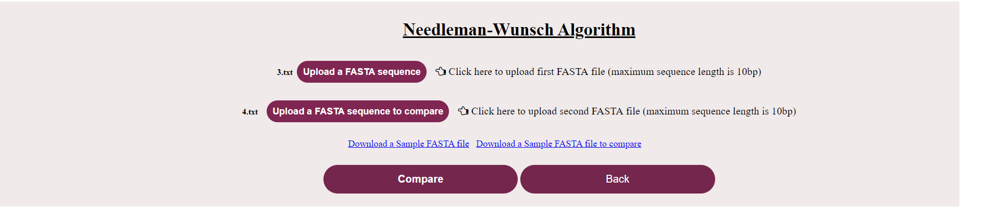 
     
      
  iii.	Click on “Compare”
      
  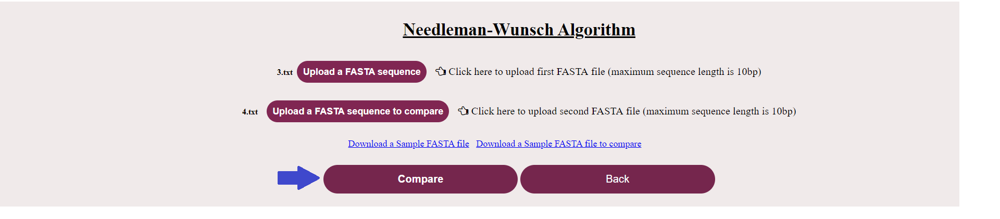 
      
      
  iv.	Result part is represented in different steps which follow one after the other. 
  
  1.	First step is Initialisation- Click on the “Initialisation” button which displays the initialization matrix and the following button pops up.
          
  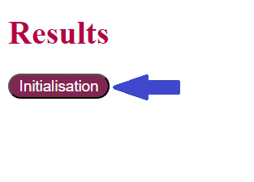 
   
  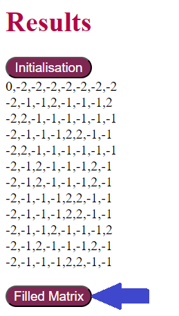
          
  2.	Second step is the Filling of the matrix- Click on the “Filled matrix” button which displays the values filled after applying the scoring function. and the following button pops up.
          
  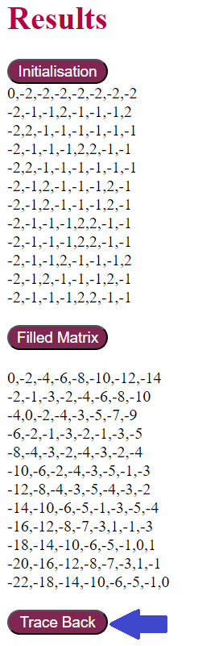
      
  3.	Third step is Traceback- Click on the “Trace Back” button which displays all possible alignment paths of the given sequences, and the following button pops up.
          
  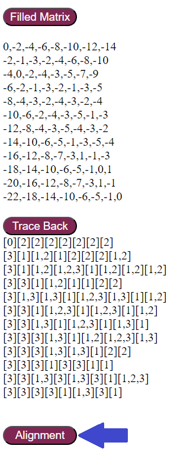 
          
  4.	Fourth step is Displaying an alignment- Click on the “Alignment” button which displays one of the alignment and its alignment score  
          
  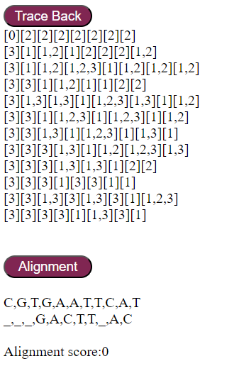 
      
